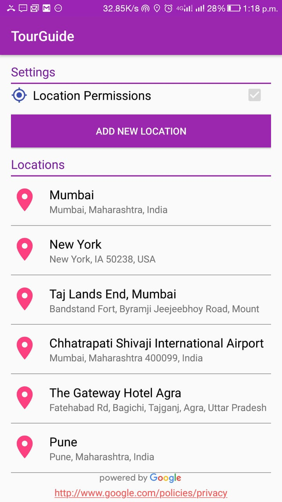
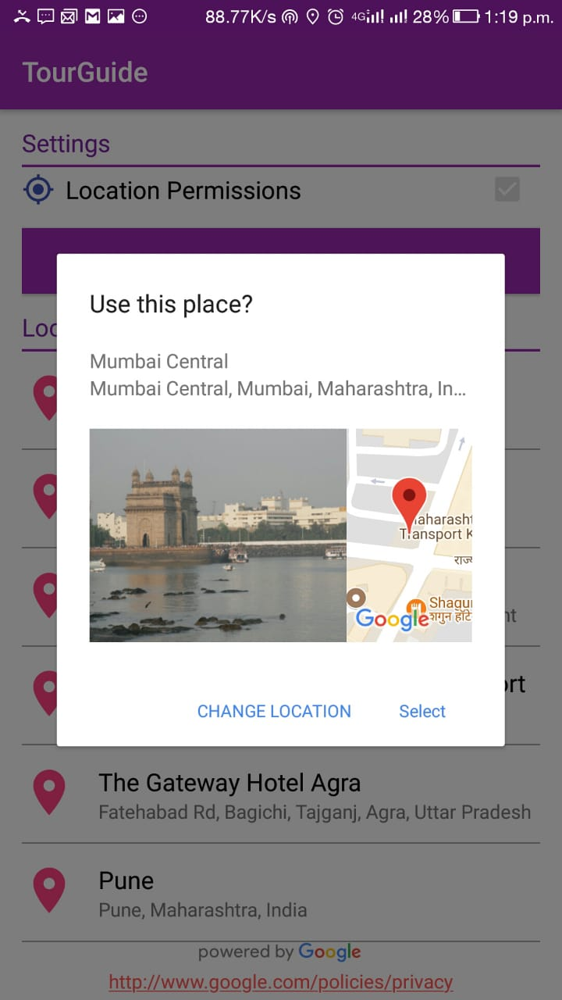
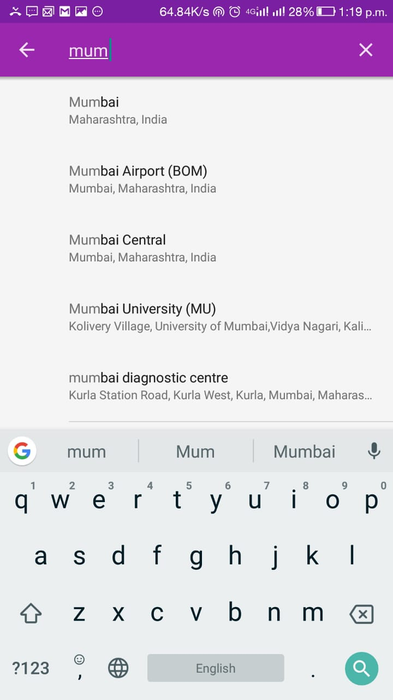
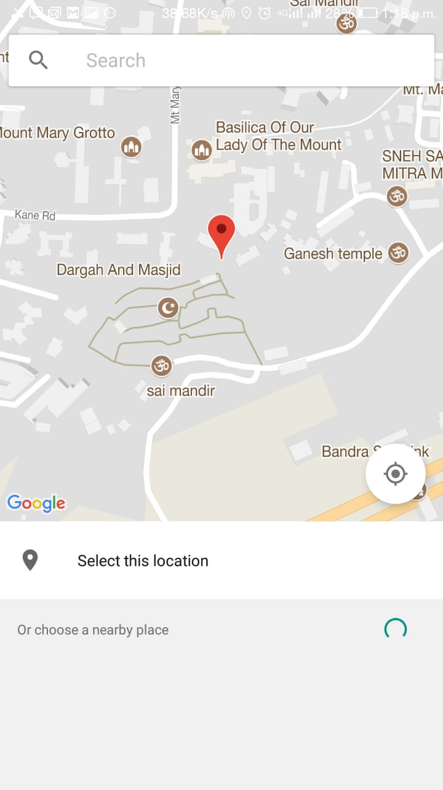

# TourGuide

### Google Places and Locations API 

The Google Places API for Android provides your app with rich information about places, including the place's name and address, the geographical location specified as latitude/longitude coordinates, the type of place (such as night club, pet store, museum), and more. To access this information for a specific place, you can use the place ID, a stable identifier that uniquely identifies a place.

In this TourGuide App we have use the following methods to retrieve data from a Place:

**getName()** – The place's name.

**getAddress()** – The place's address, in human-readable format.

**getID()** – The textual identifier for the place. Read more about place IDs in the rest of this page.

## Screenshots

  
  
